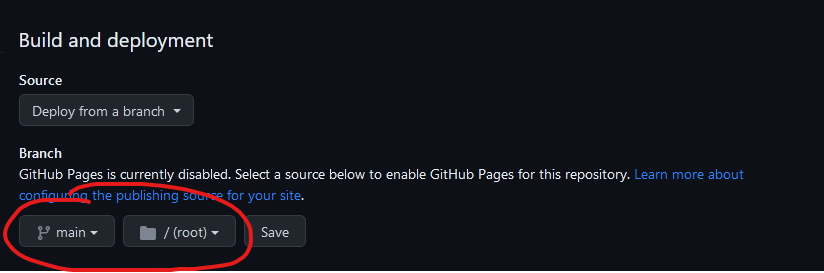

<!-- markdownlint-disable MD033 MD041 -->

<div id=top>

> **Warning**:
> bad-linktree is still in development! I wouldn't recommend using this for your professional linktree thing yet, feel free to do so anyway.

# bad-linktree

my own custom linktree alternative.

[see the page where it demostrates what it can do](https://williamanimate.github.io/bad-linktree/index.html)

[see what it would look like "professionally"](https://williamanimate.github.io/bad-linktree/e.html)

## **Table of Contents**

* [**Table of Contents**](#table-of-contents)
* [**Pros & Cons**](#pros--cons)
* [**Working browsers**](#working-browsers)
* [**Getting started (editing the page)**](#getting-started-editing-the-page)
* [**Getting started (deploying the page)**](#getting-started-deploying-the-page)
* [**Attribution**](#attribution)
* [**Legal/License**](#legallicense)

## Pros & Cons

This isn't perfect, but i've tried my best!

### Pros

* **No watermark** at the bottom of the page.

* **No forced ads** by default, but you can add your own ads... if you really want to.

* **You have full control** over the page by styling your own css, adding your own JS, and even editing the HTML. This is simply a starting point.

* **Nearly zero limitations**: Lets say some specific website TOS doesn't allow `x`, but your whole point revolves around `x` and you want to make it themed like such (and `y` isn't an option)<br>
...Or simply you can't find one with such a permissive license...

* **Fully responsive** webpage. Though to be fair, it isn't that hard to make it responsive, its simply buttons with text on it.

### Cons

* **Spaghetti** html and css.

* **Poor documentation** sorry.

* **You have to host it yourself** or you can simply use github pages.

* **No advanced color customization** you can only select 1 color or something.

## Working browsers

Tested and works as WilliTended™ on...

**Windows 10** 22H2 OS Build 19045.3393 64 bit on a 1920x1080 display.

**Firefox** 117.0

> Only known problem: sometimes, having backround blur causes performance problems. Firefox L right here
>
> [https://greensock.com/forums/topic/15937-is-it-me-or-firefox/](https://greensock.com/forums/topic/15937-is-it-me-or-firefox/)

**MS Edge** 116.0.1938.62

> May have perf problems here. Common edge L.

**DuckDuckGo (browser)** whothehellknowswhichversion (WebView2 115.0.1901.200)

**Brave** 1.57.53 (Chromium 116.0.5845.114)

***

> Hey can you test this on google chrome?
>> chrome is just chromium with telemetry. *microsoft edge is better.*.
>>> either way, test or not, if it works on any chromium browser, it works on chrome.

## Getting started (editing the page)

### Prerequisities for editing

* **A calculator** - Preferably one that can do billions of calculations in a second, but if you have to, feel free to use the [**BBC Micro**](https://wikipedia.org/wiki/BBC_Micro) if you have to.

* **Something to edit files with** - If you're using my favourite distro of the NT kernel, Windows, there is a preinstalled application called **Notepad.exe** (located in the system32 folder) that should work. If you're on ~~GNU/Linux~~ ~~GNU/Linux~~ [Linux](https://wikipedia.org/wiki/Linux) based operating systems, you probably already have [**emacs**](https://wikipedia.org/wiki/Emacs), [**nvim**](https://wikipedia.org/wiki/Vim_(text_editor)#Neovim), [**vim**](https://wikipedia.org/wiki/Vim_(text_editor)), [**vi**](https://wikipedia.org/wiki/Vi) or [**gnu nano**](https://wikipedia.org/wiki/GNU_nano) installed. feel free to use that.

* **Literally any sort of knowlege on css** - so you don't break the webpage, hopefully.

### Editing

I don't know. You've come this far, im sure you'll think of something.

## Getting started (deploying the page)

There is no backend (so you *probably* don't need to use docker). As long as you know how to set up a frontend page, then you're all set.

### Prerequisities for deploying

* **A calculator** - One of those modern calculators that can do billions of calculations in a second, chances are, you already have one right now, infront of you.

* **Something that can display "on" and "off" (like a monitor)** - If it can play *bad apple*, then it can be displayed. Though for optimal editing, you should use one that can display millions of colors.

* **Git** - To download the repo, commit and push to your own repo. but you can always click on **Code > Download ZIP** or similar.

* **Something to deploy the HTML page to** - I'm not a server admin I don't know lol.

### Deploying

so basically, you'll want to download the entire site, and when I say entire, I mean just the frontend (which is only what's included in this repo).

```bash
git clone https://github.com/williamanimate/bad-linktree bad-linktree
cd bad-linktree
```

After that, all you need to do is start the server. I am no server admin though, so i have no clue how to do that.

<details>
<summary>how about hosting on github pages so I don't have to buy a server and a whole domain? (optional side mission)</summary>

Sure!

<!-- markdownlint-disable MD029 -->

1. download the repo

 ```bash
 git clone https://github.com/williamanimate/bad-linktree bad-linktree
 ```

2. do something

edit the files to your liking. For more info, see [#Editing](#editing)

3. deploy the site to github

 ```bash
 git commit -m "0"
 ```

 > **Note**:
 > I have never used git from the command line, you probably have to select/create a repo first or something I don't know.

4. fire up the site

go to github and navigate to your new repo containing the code.

> **Remember**:
> You may need your repo to be public in order to deploy it. For more info, see [this page](https://docs.github.com/en/pages/getting-started-with-github-pages/configuring-a-publishing-source-for-your-github-pages-site)

then click on settings

then click on pages

then select the options below



click save.

5. congrats!

You have deployed your site to the world, for anyone to see!

</details>

<details>
<summary>but what if i do want a backend?</summary>

**Then make a pull request or something so I can add it**. Not sure why you would want a backend for this though. It only makes life harder.

</details>

# Legal/License

This code under this repository is licensed under the [Unlicense](https://choosealicense.com/licenses/unlicense/).

This means that you're **allowed** to use this code, for any purpose, without attribution. Do whatever, have fun.

## Attribution

Attribution is provided within the [credits.txt](credits.txt) file.

# [back to top](#top)

Hey there traveller, it appears as if you have fallen.<br>
**Fear not**, as with a single click of a button, you can go all the way up!
